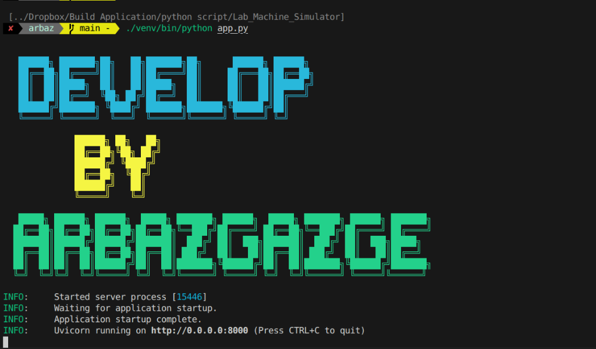
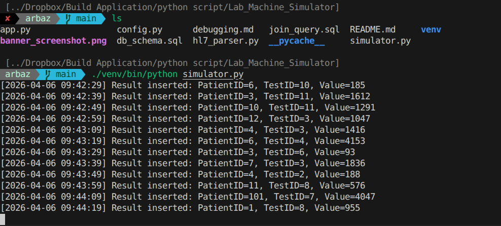
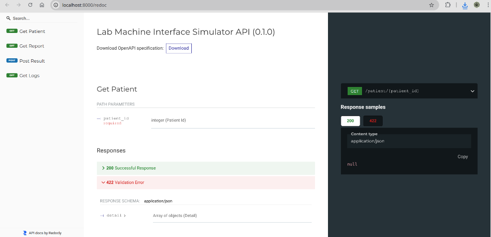

# Lab Machine Interface Simulator

A simple simulator that generates test results, stores them in a MySQL database, and provides REST APIs to fetch patient reports.

## App.py Preview


## Simulator Preview


## API Documentation Preview (ReDoc)



## Features
- **Database Schema**: Tables for Patients, Tests, Results, and Logs.
- **Machine Simulator**: Generates random test results every 10 seconds.
- **REST APIs**: endpoints for patients, results, and logs using FastAPI.
- **HL7 Parser**: Bonus feature to parse HL7 messages and store results.

## Setup Instructions

### 1. Database Setup
- Open your MySQL client and run the following script:
  `mysql -u root -p < db_schema.sql`
- If you have already created the database, you can use:
  `mysql -u root -p lab_machine_db < db_schema.sql`

### 2. Configure Database
- Edit `config.py` with your MySQL credentials (`host`, `user`, `password`, `database`).

### 3. Install Dependencies
```bash
# It is recommended to use a virtual environment
python3 -m venv venv
./venv/bin/pip install mysql-connector-python fastapi uvicorn pydantic
```

### 4. Running the Project
#### A. Start the Machine Simulator:
```bash
./venv/bin/python simulator.py
```

#### B. Start the REST API:
```bash
./venv/bin/python app.py
```
Wait for the simulator to run at least once to see data in the API.

#### C. Run the HL7 Parser (Bonus):
```bash
python hl7_parser.py
```

## API Endpoints
- **GET** `/patient/{patient_id}`: Fetch patient details.
- **GET** `/report/{patient_id}`: Fetch patient report with joined data.
- **POST** `/machine/result`: Manually add machine result.
- **GET** `/machine/logs`: View recent machine activity logs.

## SQL Task (Part 4)
The SQL query to display comprehensive report data is located in `join_query.sql`.

## Debugging (Part 5)
Analysis and solutions for common API/database visibility issues are documented in `debugging.md`.
